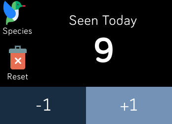

# Birdcount

An app for tracking the count of bird sightings for Fitbit OS watches.

|                         Screenshot                     |    Device    |
|:------------------------------------------------------:|:------------:|
| | Fitbit Ionic |
| | Fitbit Versa |

## Installation

The app is currently under active development, once we have reached a stable release we will be submitting to Fitbit for review and publication on the Fitbit App Gallery.

## Roadmap

- Persist count after restarting app
- Allow for count reset
- Select bird species from list to categorise count
- Allow for multiple counts running simultaneously
- Publish count data to device 

## Supports

BirdCount has been developed for use with Fitbit SDK 4.2, and is compatible with the following devices.

- Ionic
- Versa
- Versa Light
- Versa 2

## Changelog

| Version  | Details                                                                |
|:---------|:-----------------------------------------------------------------------|
| 0.3.0    | Allow deleting of current count data and resetting to 0                |
| 0.2.0    | Save current count to filesystem to allow persisting between app loads |
| 0.1.0    | Add incremenet / decrement buttons                                     |

## Attributions

Bird Icon made by <a href="https://www.flaticon.com/authors/freepik" title="Freepik">Freepik</a>, Trash Icon made by <a href="https://www.flaticon.com/authors/pixelmeetup" title="Pixelmeetup">Pixelmeetup</a> from <a href="https://www.flaticon.com/" title="Flaticon">www.flaticon.com</a>
